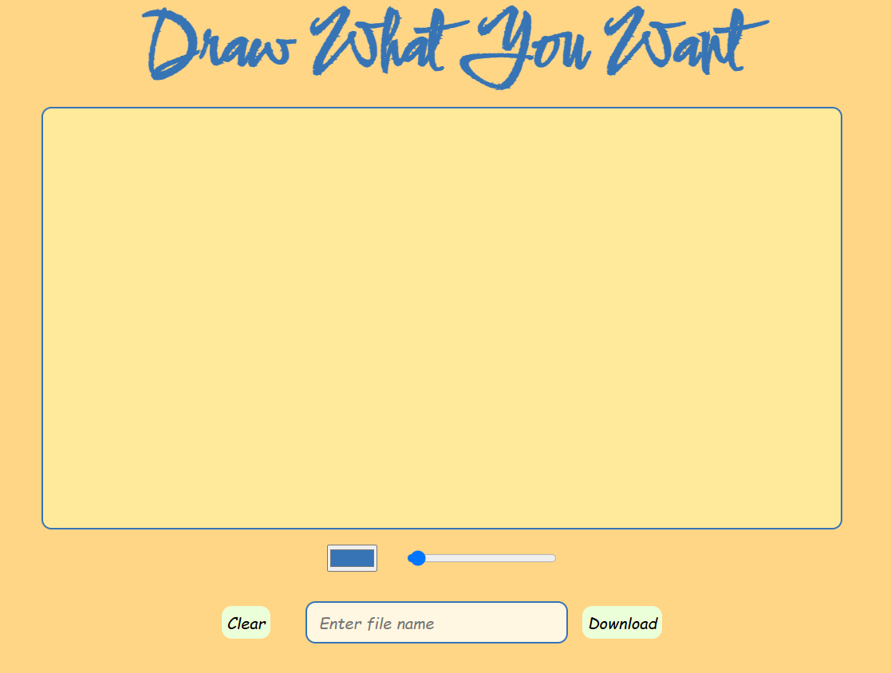

# 🎨 Drawing Canvas

A clean, responsive browser-based drawing app built with **HTML**, **CSS**, and **vanilla JavaScript** — no libraries, no frameworks, just pure front-end code.

*This app lets users draw freehand with custom colors and brush sizes, clear the canvas, and download their artwork as an image.*
---
## 📷 Preview



## 🔗 Live Demo

> 🚀 [Click here to try the app](https://niteshgurjarr.github.io/Drawing-canvas)

---

## 📸 Features

- 🖌️ Draw freely using mouse or touch input
- 🎨 Color picker for custom brush colors
- 📏 Adjustable brush size slider
- ♻️ Clear canvas with one click
- 💾 Download your drawing as a PNG
- ✨ Custom filename support
- 📱 Mobile responsive design

---

## 🛠️ Technologies Used

- HTML5
- CSS3
- JavaScript (Vanilla JS)

---

## 📂 Project Structure
```bash
canvas-Drawing-App/
│
├── index.html       # Main HTML file
├── styles.css       # App styling
├── index.js         # Canvas logic and event handling
├── preview.png      # Preview image used in README
├── README.md        # Project documentation
```

---

## ✏️ Usage

- Select a color using the **color picker** 🎨  
- Adjust the **brush size** using the slider 📏  
- Start drawing on the canvas 🖍️  
- Use **Clear** to erase or **Download** to save your work as a `.png` file  
- Name your drawing using the **file name input** 📂  

---

Made with ❤️ by [Nitesh Gurjar](https://github.com/niteshgurjarr)

